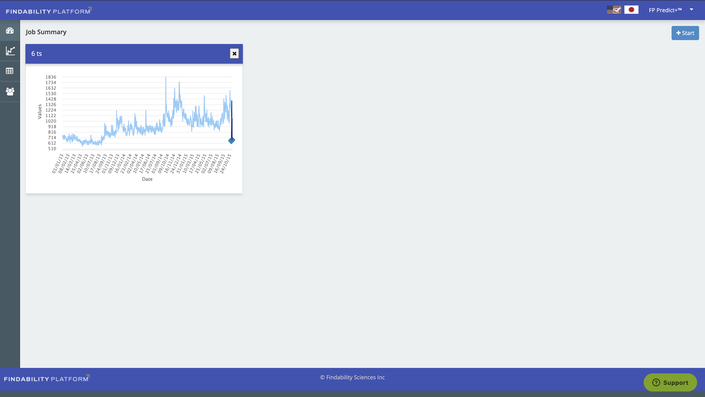
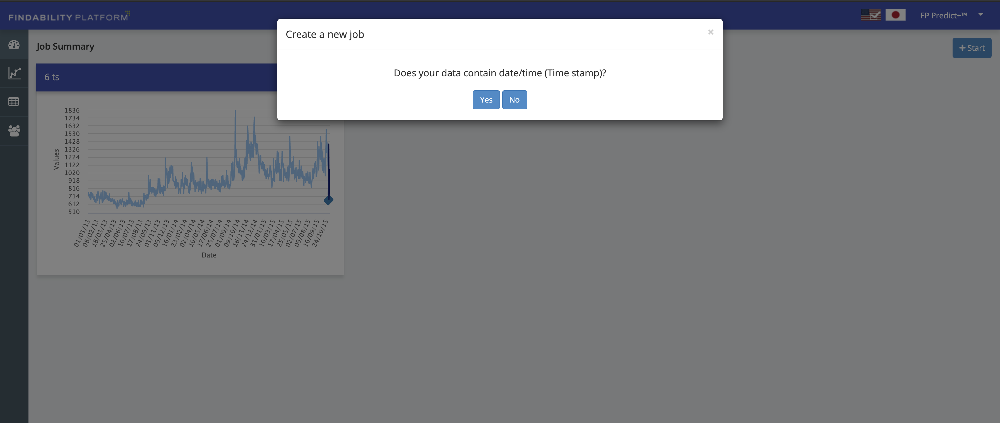
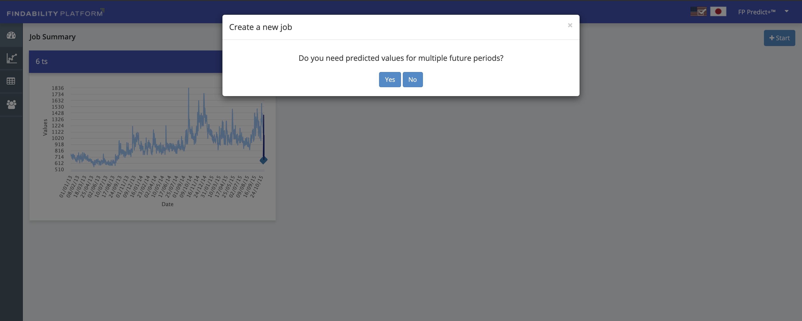
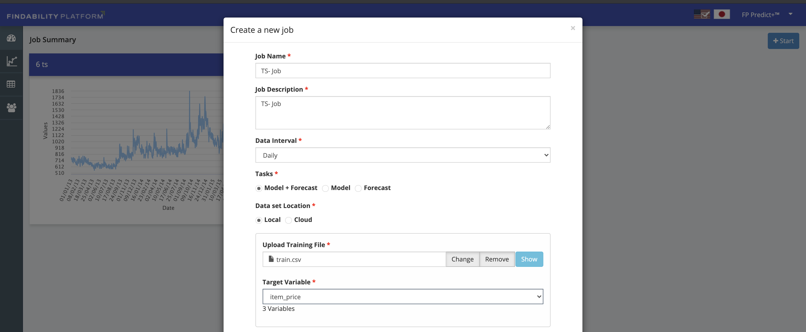
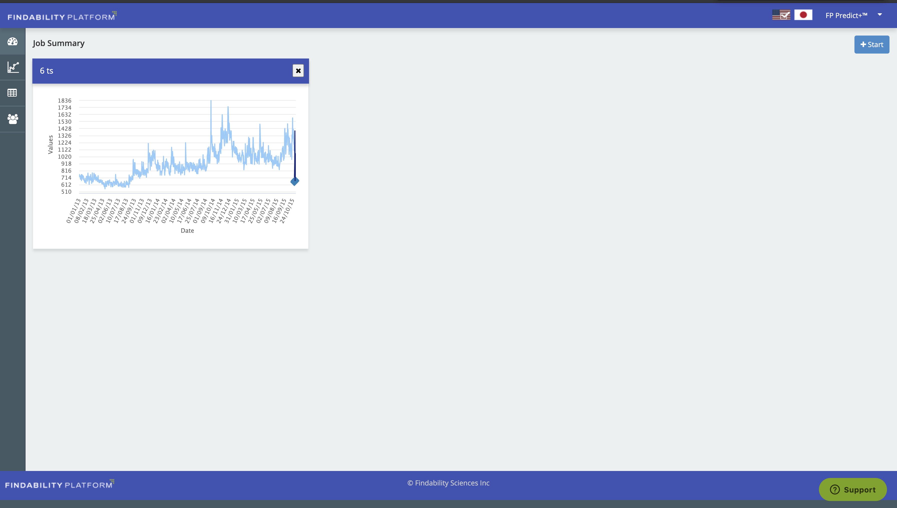
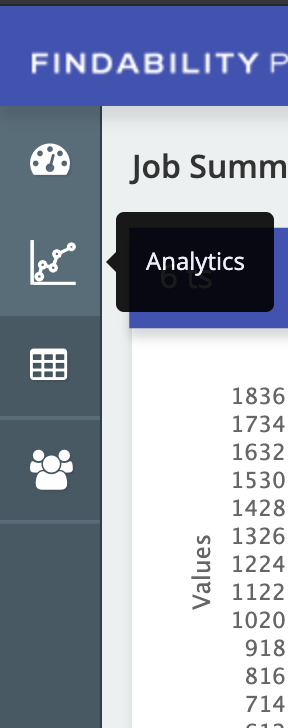
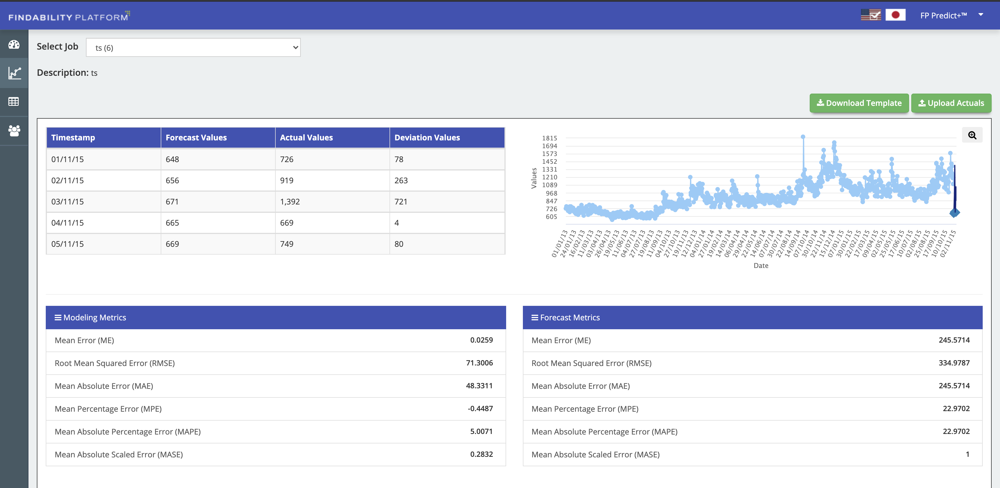
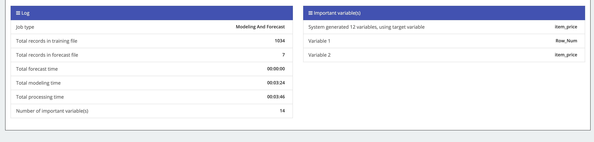
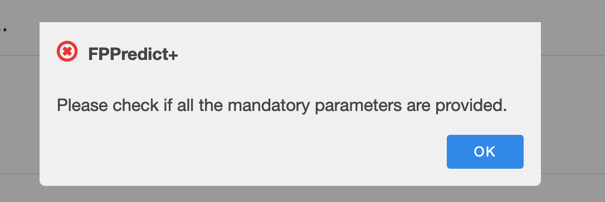

This tutorial demonstrates a time-series on FP Predict +, Using a dataset that shows the how the prices differ over a period of time at a paricular retail store outlet.

## Learning objectives

* Users will learn how to operate with RHM FP Predict + Operator
* Setup a Time-Series Model on FP Predict + 
* Learn how to configure the Training and Forecast parameters
* View and analyze the time-series results

## Prerequisites

List pre-reqs here.

* RHM FP Predict + operator

## Estimated time

Completing this tutorial should take about 20 minutes.

## Steps

### Create a new Time-Series Job

* Login to your FP Predict + Operator

* Click on `+ Start` button

* A prompt will pop-up asking if your data contains Time-Stamp. Select `Yes`.

* Another prompt will pop-up asking if you will be predicting values. Select `Yes`.

### Configure the Time-Series Model

* Download the dataset [train.csv](https://github.com/IBM/build-a-time-series-model-using-fp-predict-plus/blob/main/datasets/train.csv)

* Download the dataset [test.csv](https://github.com/IBM/build-a-time-series-model-using-fp-predict-plus/blob/main/datasets/test.csv)

* Enter the details as follows-

  * Enter `Job Name` as `TS` (Pls avoid special characters in the name)
  * Dataset location must be `local`
  * Daily Interval set as `Daily`
  * Tasks `Model + Forecast`
  * Upload training file from the downloaded file `train.csv`
  * Set Target Variable as `item_price`
  
  

  * Upload the forecast file from the downloaded file `sales_test.csv`
  * Set Timestamp variable as `date`
  * Set Timestamp Format as `dd/mm/yyyy`
  * Click on `Run`
  
  
  
*** Note: It will take about 10 minutes to setup the model, pls wait and don't refresh the page until it's over ****  

### Analyze your Output

After the completion you will receive an output as given below-

  

The above graph shows the time-series of prices over the time period 2013 to 2015.

Click on the `analytics` icon to analyze your results

  
  
  #### Analysis Description
  
  1. The first table on the top left corner, depcits the actual v/s predicted and the difference in prediction for each time        interval. Note that it provides only the head values of the result table
  2. The graph on the top right represents the same output as received on the dashboard
  3. The `Modeling Metrics` and `Forecast Metrics` provides measures of the trained model using techniques such as Mean            Error, Root Mean Square,Mean Percentage Error, Mean Absolute Percentage Error and Mean Absolute Scaled Error. These will      allow us to evaluate how well the underlying model is trained and forecasts.
  4. Log table provides metadata of the trained file, such as the number of rows and time taken to train.
  5. The last table is about the `Important Rows` since ours is a time-series model with only one underlying feature       
     distribution.

  

  
  
## Troubleshooting

* Must have only 2 other columns apart from the date - Row sequence number and Target Variable
* Ensure the time interval is correctly maintained through the training and forecast data. Eg: If you put the time interval     as Daily, your dataset MUST contain only one record for a particular day.
* Additionally, if you set Daily as interval, your forecast data MUST have a forecast for everyday without a gap.
* If you encounter the below error-
  
  
  
  Clear your browser cache or try in another browser.

For further reference, look at the datasets used in this tutorial.
  

## Summary

In summary, this tutorial helps you to understand how to perform time-series analysis with Red Hat Market Place using the FP Predict + Operator.

